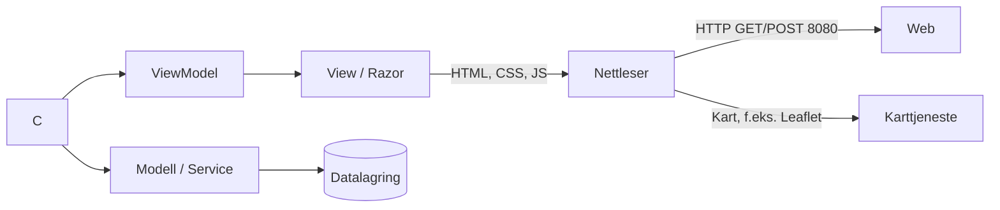

# [Prosjektnavn]

ASP.NET Core MVC-applikasjon som kjører i Docker. Brukeren fyller ut et skjema, velger et punkt i et kart, og dataene vises på egne sider.

**Gruppe:** [Gruppe 8] · **Emne:** [IS-202] · **Medlemmer:** [Darin, Marius, Lars, Mahan, Yasin]

---

## Innhold

1. [Drift](#1-drift)
2. [Systemarkitektur](#2-systemarkitektur)
3. [Testing](#3-testing)
4. [Dokumentasjon i koden](#4-dokumentasjon-i-koden)
5. [Bruk av KI](#5-bruk-av-ki)

---

## 1. Drift

### Forutsetninger
- Docker 29.4.1 og Docker Compose
- Git
- (Ved lokal utvikling uten Docker) .NET SDK 10.0.401

### Kjøre applikasjonen

```bash
git clone https://github.com/MahanBig/Semster3
cd Innlevering 1
docker compose up --build
```

Applikasjonen er deretter tilgjengelig på `http://localhost:8080`.

### Stoppe og rydde opp

```bash
docker compose down          # stopper containerne
docker compose down -v       # stopper og sletter volumer (data)
```

### Konfigurasjon

| Innstilling | Sted | Beskrivelse |
|---|---|---|
| `ASPNETCORE_ENVIRONMENT` | `docker-compose.yml` | `Development` / `Production` |
| Connection string | `appsettings.json` / miljøvariabel | MariaDB |


---

## 2. Systemarkitektur

### Oversikt



### Lag og ansvar

| Lag | Ansvar | Filer/mapper |
|---|---|---|
| Controller | Tar imot GET/POST, validerer, velger view | `Controllers/` |
| ViewModel | Data som sendes mellom controller og view | `Models/ViewModels/` |
| Model | Domeneobjekter | `Models/` |
| View | Razor-sider, responsivt design | `Views/` |
| Statiske filer | CSS, JavaScript, bilder | `wwwroot/` |

### Dataflyt

1. **Skjema:** `GET /[Controller]/[Action]` viser skjemaet. Ved innsending sender nettleseren `POST /[Controller]/[Action]`.
2. **Kart:** Brukeren velger et punkt i kartet. Koordinatene [lagres i skjult felt / sendes via POST / hentes via JS].
3. **Visning:** Etter POST [redirecter/viser] applikasjonen data på `/[Controller]/[Visningsside]`.

### Teknologivalg

| Teknologi | Begrunnelse |
|---|---|
| ASP.NET Core MVC | Krav i oppgaven |
| Docker | Lik kjøremiljø på alle maskiner |
| [Leaflet/OpenLayers/...] | fra forelesning |
| [Bootstrap/CSS-rammeverk] | Responsivt design |
| [Database, MariaDB] | fra forelesning |

### Docker

- `Dockerfile`: [multi-stage build: SDK for bygg, ASP.NET runtime for kjøring]
- `docker-compose.yml`: [tjenester, porter, volumer]

---

## 3. Testing

Automated tests
The project has unit tests in Heimevernet.Web.UnitTests for the controllers, the repository and the database seeder. Run them with:

    dotnet test --project .\Heimevernet.Web.UnitTests\Heimevernet.Web.UnitTests.csproj


Manual tests
| # | Test | Expected result | Result |
| --- | --- | --- | --- |
| 1 | Start the AppHost and check Docker Desktop | heimevernet-web and mariadb containers are running | Passed |
| 2 | Open Ressurser | A list of resources from the database is shown | Passed |
| 3 | Click a resource | The details page for that resource is shown | Passed |
| 4 | Open Korriger kart, click the map, write a description and submit | The overview page shows the position in a table and on the map | Passed |

## 4. Bruk av KI


### Oversikt

- Vi brukte Claude til å strukturere oppgaven og hjelpe oss videre når det oppsto problemer
- Vi brukte Claude til å hjelpe oss med å få opp README mappen og strukturere den siden vi var ikke sikre på hvordan den skulle se ut
- Vi fikk Claude til å se gjennom koden for å feilsøke og hjelpe med eventuelle endringer
- 
## Eksempel på prompt
Verktøy: Claude
Formål: Finne ut hvor mye av oppgaven som var ferdig.
Resultat: Claude gikk gjennom det vi hadde og den viste at README var litt tynn og måtte jobbes videre med, så vi fikk en god struktur på hvordan vi kunne gjøre det


### Refleksjon
- Hva fungerte godt med KI: Når vi satt fast med problemer var det et bra verktøy for å forstå problemet og å hjelpe oss med problemet
- Hva fungerte dårlig eller måtte rettes: Når et problem oppsto så var vi litt kjappe til å bare få hjelp av Claude
- Hvordan vi kontrollerte at KI-generert kode var riktig: Vi testet koden og gikk gjennom den
- Hva vi ville gjort annerledes: Vi ble generelt ganske fornøyd med vår prossess med oppgaven
